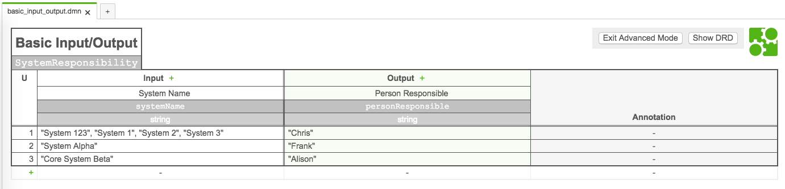

# DMN Unit Testing - Basic Example

This is a basic DMN Unit testing example that uses Spock Datatables

See Spock spec at: `./src/test/groovy/1_dmn_basic/DmnBasicSpec.groovy`

- Camunda 7.8
- Java 8
- Maven

# How to run

Load terminal to root folder and run: `mvn clean test`

# DMN

A basic DMN example.
Can be found in: `./src/test/resources/dmn/basic_input_output.dmn`



# Build Output Example

```
-------------------------------------------------------
 T E S T S
-------------------------------------------------------
Running DmnBasicSpec
Starting Spec
Evaluating: 'System 123' and expecting: 'Chris'
DMN has only 1 result
Output of DMN: 'personResponsible: Chris'
Evaluating: 'System 1' and expecting: 'Chris'
DMN has only 1 result
Output of DMN: 'personResponsible: Chris'
Evaluating: 'System 2' and expecting: 'Chris'
DMN has only 1 result
Output of DMN: 'personResponsible: Chris'
Evaluating: 'System 3' and expecting: 'Chris'
DMN has only 1 result
Output of DMN: 'personResponsible: Chris'
Evaluating: 'System Alpha' and expecting: 'Frank'
DMN has only 1 result
Output of DMN: 'personResponsible: Frank'
Evaluating: 'Core System Beta' and expecting: 'Alison'
DMN has only 1 result
Output of DMN: 'personResponsible: Alison'
Finished Spec
Tests run: 1, Failures: 0, Errors: 0, Skipped: 0, Time elapsed: 1.21 sec - in DmnBasicSpec

Results :

Tests run: 1, Failures: 0, Errors: 0, Skipped: 0

------------------------------------------------------------------------
BUILD SUCCESS
------------------------------------------------------------------------
Total time: 6.424 s
Finished at: 2018-01-07T15:19:57-05:00
Final Memory: 16M/143M
------------------------------------------------------------------------
```

# Spock Data Table Example

See the [Spec](https://github.com/DigitalState/Camunda-Spock-Testing/blob/master/DMN/src/test/groovy/1_dmn_basic/DmnBasicSpec.groovy#L69) for specific use case example

```groovy
where:
          systemName | personResponsible
        'System 123' | 'Chris'
          'System 1' | 'Chris'
          'System 2' | 'Chris'
          'System 3' | 'Chris'
      'System Alpha' | 'Frank'
  'Core System Beta' | 'Alison'
```