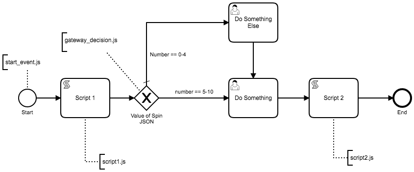

# End to End Test

This is a end to end test that looks to demonstrate a production level implementation of Unit Testing using Spock Framework.

Overall goals will be to test:

1. BPMN process 
1. Scripts inside of the BPMN. Each script should be a external file.


Notes:

1. Camunda 7.8
1. Java 8
1. Uses Spock Framework / Groovy for tests
1. All Scripts being executed in Camunda are exteral resource scripts and use Javascript/Nashorn as script language.
1. BPMN and Scripts are located in `./src/test/resources/bpmn/end-to-end`
1. Unit Test Specs are located in: `./src/test/groovy/end-to-end`

# How to run

Execute: `mvn clean test` in terminal when in root of project folder.


# BPMN Image



----

# Notes:

Task Assignments:
1. Do Something: Task_1bvdtdv: Assginee: `chris`
2. Do Something Else: Task_1xjtauh: Assginee: `john`


# Build Report Example

```json
loadLogFile([{
    "package": "EndToEndNashornSpec",
    "name": "Nashorn Unit Testing Test",
    "start": 1515094880077,
    "narrative": "As a bpmn developer I want to Unit Test Nashorn Scripts",
    "features": [
        {
            "name": "Nashorn: gateway_decision.js",
            "start": 1515094880079,
            "output": [
                "Setup Mocks and binding\n",
                "Execute Script\n",
                "Gateway Decision matches expection\n",
                "Script Response: false\n",
                "DataTable Expected Response: false\n",
                "Setup Mocks and binding\n",
                "Execute Script\n",
                "Gateway Decision matches expection\n",
                "Script Response: false\n",
                "DataTable Expected Response: false\n",
                "Setup Mocks and binding\n",
                "Execute Script\n",
                "Gateway Decision matches expection\n",
                "Script Response: false\n",
                "DataTable Expected Response: false\n",
                "Setup Mocks and binding\n",
                "Execute Script\n",
                "Gateway Decision matches expection\n",
                "Script Response: false\n",
                "DataTable Expected Response: false\n",
                "Setup Mocks and binding\n",
                "Execute Script\n",
                "Gateway Decision matches expection\n",
                "Script Response: false\n",
                "DataTable Expected Response: false\n",
                "Setup Mocks and binding\n",
                "Execute Script\n",
                "Gateway Decision matches expection\n",
                "Script Response: false\n",
                "DataTable Expected Response: false\n",
                "Setup Mocks and binding\n",
                "Execute Script\n",
                "Gateway Decision matches expection\n",
                "Script Response: true\n",
                "DataTable Expected Response: true\n",
                "Setup Mocks and binding\n",
                "Execute Script\n",
                "Gateway Decision matches expection\n",
                "Script Response: true\n",
                "DataTable Expected Response: true\n",
                "Setup Mocks and binding\n",
                "Execute Script\n",
                "Gateway Decision matches expection\n",
                "Script Response: true\n",
                "DataTable Expected Response: true\n",
                "Setup Mocks and binding\n",
                "Execute Script\n",
                "Gateway Decision matches expection\n",
                "Script Response: true\n",
                "DataTable Expected Response: true\n",
                "Setup Mocks and binding\n",
                "Execute Script\n",
                "Gateway Decision matches expection\n",
                "Script Response: true\n",
                "DataTable Expected Response: true\n",
                "Setup Mocks and binding\n",
                "Execute Script\n",
                "Gateway Decision matches expection\n",
                "Script Response: true\n",
                "DataTable Expected Response: true\n",
                "Setup Mocks and binding\n",
                "Execute Script\n",
                "Gateway Decision matches expection\n",
                "Script Response: false\n",
                "DataTable Expected Response: false\n"
            ],
            "end": 1515094881094,
            "result": "passed",
            "attachments": [
                
            ]
        },
        {
            "name": "Nashorn: script1.js",
            "start": 1515094881095,
            "output": [
                "Setup Mocks and binding\n",
                "Execute Script\n",
                "Script1.js output matches the expected result\n"
            ],
            "errorOutput": [
                "Jan 04, 2018 2:41:21 PM org.slf4j.impl.JCLLoggerAdapter info\nINFO: SPIN-01010 Discovered Spin data format provider: org.camunda.spin.impl.json.jackson.format.JacksonJsonDataFormatProvider[name = application\/json]\n",
                "Jan 04, 2018 2:41:21 PM org.slf4j.impl.JCLLoggerAdapter info\nINFO: SPIN-01010 Discovered Spin data format provider: org.camunda.spin.impl.xml.dom.format.DomXmlDataFormatProvider[name = application\/xml]\n",
                "Jan 04, 2018 2:41:21 PM org.slf4j.impl.JCLLoggerAdapter info\nINFO: SPIN-01009 Discovered Spin data format: org.camunda.spin.impl.xml.dom.format.DomXmlDataFormat[name = application\/xml]\n",
                "Jan 04, 2018 2:41:21 PM org.slf4j.impl.JCLLoggerAdapter info\nINFO: SPIN-01009 Discovered Spin data format: org.camunda.spin.impl.json.jackson.format.JacksonJsonDataFormat[name = application\/json]\n"
            ],
            "end": 1515094881758,
            "result": "passed",
            "attachments": [
                
            ]
        },
        {
            "name": "Nashorn: script2.js",
            "start": 1515094881760,
            "output": [
                "Setup Mocks and binding\n",
                "Execute Script\n",
                "Script2.js output matches the expected result\n"
            ],
            "end": 1515094881786,
            "result": "passed",
            "attachments": [
                
            ]
        },
        {
            "name": "Nashorn: start_event.js",
            "start": 1515094881787,
            "output": [
                "Setup Mocks and binding\n",
                "Execute Script\n",
                "start_event.js output matches the expected result\n"
            ],
            "end": 1515094882043,
            "result": "passed",
            "attachments": [
                
            ]
        }
    ],
    "end": 1515094882043,
    "result": "passed",
    "attachments": [
        
    ]
}])

loadLogFile([{
    "package": "EndToEndSpec",
    "name": "End to End Testing of BPMN",
    "start": 1515094882258,
    "narrative": "As a bpmn developer I want to have end to end tests\nthat perform unit tests for BPMN",
    "errorOutput": [
        "Jan 04, 2018 2:41:22 PM org.springframework.beans.factory.xml.XmlBeanDefinitionReader loadBeanDefinitions\nINFO: Loading XML bean definitions from class path resource [camunda_config\/camunda.cfg.xml]\n",
        "Jan 04, 2018 2:41:23 PM org.slf4j.impl.JCLLoggerAdapter info\nINFO: ENGINE-12003 Plugin 'ConnectProcessEnginePlugin' activated on process engine 'default'\n",
        "Jan 04, 2018 2:41:24 PM org.slf4j.impl.JCLLoggerAdapter info\nINFO: CNCT-01004 Discovered provider for connector id 'http-connector' and class 'org.camunda.connect.httpclient.impl.HttpConnectorImpl': 'org.camunda.connect.httpclient.impl.HttpConnectorProviderImpl'\n",
        "Jan 04, 2018 2:41:24 PM org.slf4j.impl.JCLLoggerAdapter info\nINFO: CNCT-01004 Discovered provider for connector id 'soap-http-connector' and class 'org.camunda.connect.httpclient.soap.impl.SoapHttpConnectorImpl': 'org.camunda.connect.httpclient.soap.impl.SoapHttpConnectorProviderImpl'\n",
        "Jan 04, 2018 2:41:24 PM org.slf4j.impl.JCLLoggerAdapter info\nINFO: ENGINE-12003 Plugin 'SpinProcessEnginePlugin' activated on process engine 'default'\n",
        "Jan 04, 2018 2:41:24 PM org.slf4j.impl.JCLLoggerAdapter info\nINFO: SPIN-01010 Discovered Spin data format provider: org.camunda.spin.impl.json.jackson.format.JacksonJsonDataFormatProvider[name = application\/json]\n",
        "Jan 04, 2018 2:41:24 PM org.slf4j.impl.JCLLoggerAdapter info\nINFO: SPIN-01010 Discovered Spin data format provider: org.camunda.spin.impl.xml.dom.format.DomXmlDataFormatProvider[name = application\/xml]\n",
        "Jan 04, 2018 2:41:24 PM org.slf4j.impl.JCLLoggerAdapter info\nINFO: SPIN-01009 Discovered Spin data format: org.camunda.spin.impl.xml.dom.format.DomXmlDataFormat[name = application\/xml]\n",
        "Jan 04, 2018 2:41:24 PM org.slf4j.impl.JCLLoggerAdapter info\nINFO: SPIN-01009 Discovered Spin data format: org.camunda.spin.impl.json.jackson.format.JacksonJsonDataFormat[name = application\/json]\n",
        "Jan 04, 2018 2:41:29 PM org.slf4j.impl.JCLLoggerAdapter info\nINFO: ENGINE-03016 Performing database operation 'create' on component 'engine' with resource 'org\/camunda\/bpm\/engine\/db\/create\/activiti.h2.create.engine.sql'\n",
        "Jan 04, 2018 2:41:29 PM org.slf4j.impl.JCLLoggerAdapter info\nINFO: ENGINE-03016 Performing database operation 'create' on component 'history' with resource 'org\/camunda\/bpm\/engine\/db\/create\/activiti.h2.create.history.sql'\n",
        "Jan 04, 2018 2:41:29 PM org.slf4j.impl.JCLLoggerAdapter info\nINFO: ENGINE-03016 Performing database operation 'create' on component 'identity' with resource 'org\/camunda\/bpm\/engine\/db\/create\/activiti.h2.create.identity.sql'\n",
        "Jan 04, 2018 2:41:30 PM org.slf4j.impl.JCLLoggerAdapter info\nINFO: ENGINE-03016 Performing database operation 'create' on component 'case.engine' with resource 'org\/camunda\/bpm\/engine\/db\/create\/activiti.h2.create.case.engine.sql'\n",
        "Jan 04, 2018 2:41:30 PM org.slf4j.impl.JCLLoggerAdapter info\nINFO: ENGINE-03016 Performing database operation 'create' on component 'case.history' with resource 'org\/camunda\/bpm\/engine\/db\/create\/activiti.h2.create.case.history.sql'\n",
        "Jan 04, 2018 2:41:30 PM org.slf4j.impl.JCLLoggerAdapter info\nINFO: ENGINE-03016 Performing database operation 'create' on component 'decision.engine' with resource 'org\/camunda\/bpm\/engine\/db\/create\/activiti.h2.create.decision.engine.sql'\n",
        "Jan 04, 2018 2:41:30 PM org.slf4j.impl.JCLLoggerAdapter info\nINFO: ENGINE-03016 Performing database operation 'create' on component 'decision.history' with resource 'org\/camunda\/bpm\/engine\/db\/create\/activiti.h2.create.decision.history.sql'\n",
        "Jan 04, 2018 2:41:30 PM org.slf4j.impl.JCLLoggerAdapter info\nINFO: ENGINE-03067 No history level property found in database\n",
        "Jan 04, 2018 2:41:30 PM org.slf4j.impl.JCLLoggerAdapter info\nINFO: ENGINE-03065 Creating historyLevel property in database for level: HistoryLevelFull(name=full, id=3)\n",
        "Jan 04, 2018 2:41:30 PM org.slf4j.impl.JCLLoggerAdapter info\nINFO: ENGINE-00001 Process Engine default created.\n"
    ],
    "output": [
        "Deployment ID: '1' has been created\n",
        "Deployment ID: '1' has been deleted\n"
    ],
    "features": [
        {
            "name": "End to End BPMN Test with Data Tables",
            "start": 1515094896231,
            "output": [
                "Starting the process instance\n",
                "Process is Active and waiting for user task completion\n",
                "'Number' value is: 1\n",
                "Completed \"Do Something Else\" task\n",
                "Complete Final User Task\n",
                "Process has ended\n",
                "Starting the process instance\n",
                "Process is Active and waiting for user task completion\n",
                "'Number' value is: 7\n",
                "Complete Final User Task\n",
                "Process has ended\n",
                "Starting the process instance\n",
                "Process is Active and waiting for user task completion\n",
                "'Number' value is: 0\n",
                "Completed \"Do Something Else\" task\n",
                "Complete Final User Task\n",
                "Process has ended\n"
            ],
            "end": 1515094897792,
            "result": "passed",
            "attachments": [
                
            ]
        }
    ],
    "end": 1515094897915,
    "result": "passed",
    "attachments": [
        
    ]
}])
```